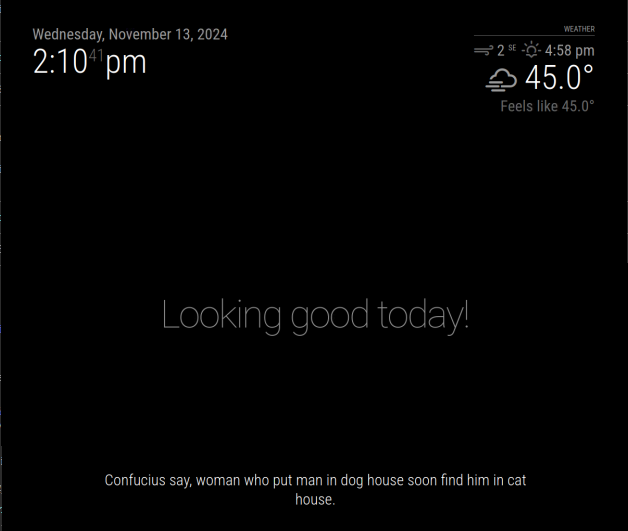

# MMM-Confucius-say: A MagicMirror Module

Displays some Confucius say quotes. 



## Installing the module

Clone this repository in your `~/MagicMirror/modules/` folder:

```bash
git clone https://github.com/jttaylor/MMM-Confucius-say
```

## Using the module

Add the module to the `~/MagicMirror/config/config.js` file:

```javascript
modules: [
		{
			module: 'MMM-Confucius-say',
			position: 'bottom_bar',
		}
]
```

You may also add configurations:

```javascript
modules: [
		{
			module: 'MMM-Confucius-say',
			position: 'bottom_bar',
			config: {
					updateInterval: 5,
					fadeSpeed: 4,
					category: 'random',
			}
		}
]
```

## Configuration options

<table>
	<thead>
		<tr>
			<th>Options</th>
			<th>Description</th>
		</tr>
	</thead>
	<tbody>
		<tr>
			<td><code>updateInterval</code></td>
			<td>Time it takes for the quote to change in seconds</td>
		</tr>
		<tr>
			<td><code>fadeSpeed</code></td>
			<td>Time it takes for the quote to fade out in seconds.</td>
		</tr>
		<tr>
			<td><code>category</code></td>
			<td>Default is <code>random</code>, but you can choose specific categories such as <code>lewd</code>, <code>serious</code>, <code>other</code>. Feel free to add your own as well! </td>
		</tr>
	</tbody>
</table>

## How to add your own quotes

You can edit the `MMM-Confucius-say.js` file, if you are comfortable merging them with any remote changes.
Alternatively, you may fork this repository to have an exclusive copy you can edit without conflicts.
